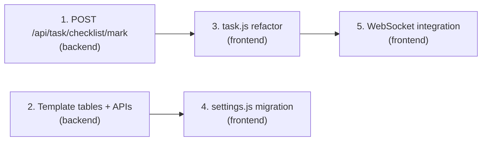

# PAGE TASKS — Development Plan (Phase 2 Gaps + Phase 3 Frontend)

> **Goal:** Complete the remaining backend APIs and refactor the entire Task page frontend to consume the dedicated checklist API and real-time WebSocket events, eliminating all client-side data derivation.

---

## Current State Analysis

### ✅ Already Implemented (Phase 1 + partial Phase 2)

| Component | File | Status |
|-----------|------|--------|
| DB table `account_activity_logs` v2 | [database.py](file:///f:/COD_CHECK/UI_MANAGER/backend/storage/database.py#L193-L222) | ✅ Done |
| Execution logger `start/finish_account_activity` | [execution_log.py](file:///f:/COD_CHECK/UI_MANAGER/backend/core/workflow/execution_log.py#L66-L127) | ✅ Done |
| Orchestrator hooks + WS events | [bot_orchestrator.py](file:///f:/COD_CHECK/UI_MANAGER/backend/core/workflow/bot_orchestrator.py#L112-L330) | ✅ Done |
| `GET /api/task/checklist` endpoint | [api.py](file:///f:/COD_CHECK/UI_MANAGER/backend/api.py#L1323-L1421) | ✅ Done |
| `GET /api/workflow/activity-registry` | [api.py](file:///f:/COD_CHECK/UI_MANAGER/backend/api.py#L845-L848) | ✅ Done |

### ❌ Missing (Phase 2 gaps + Phase 3)

| Component | Priority | Scope |
|-----------|----------|-------|
| `POST /api/task/checklist/mark` (manual override) | High | Backend |
| `task_templates` DB tables | Medium | Backend |
| `GET/POST /api/task/checklist/template` endpoints | Medium | Backend |
| Frontend refactor of [task.js](file:///f:/COD_CHECK/UI_MANAGER/frontend/js/pages/task.js) to use checklist API | **Critical** | Frontend |
| Settings page: replace localStorage with API | Medium | Frontend |
| WebSocket listeners in Task page | High | Frontend |

---

## Proposed Changes

### Component 1: Backend — Manual Mark API

#### [MODIFY] [api.py](file:///f:/COD_CHECK/UI_MANAGER/backend/api.py)

Add new endpoint after line ~1421:

```python
@app.post("/api/task/checklist/mark")
async def mark_task_checklist(body: dict):
    """
    Manual override to mark an activity as done/undone for an account.
    Body: {
        account_id: int,
        activity_id: str,
        status: "SUCCESS" | "UNDO",   # UNDO removes the manual override
        game_id: str (optional),
        group_id: int (optional)
    }
    """
```

- When `status="SUCCESS"`: Insert a new row into `account_activity_logs` with `source="manual"`.
- When `status="UNDO"`: Delete the manual row or set status to `CANCELED`.

---

### Component 2: Backend — Template Persistence

#### [MODIFY] [database.py](file:///f:/COD_CHECK/UI_MANAGER/backend/storage/database.py)

Add two new tables to `CREATE_TABLES_SQL`:

```sql
-- Task checklist templates
CREATE TABLE IF NOT EXISTS task_templates (
    id          INTEGER PRIMARY KEY AUTOINCREMENT,
    name        TEXT NOT NULL,
    scope       TEXT DEFAULT 'org',     -- 'org' | 'user' | 'group'
    scope_id    INTEGER DEFAULT 0,      -- user_id or group_id when scope != 'org'
    is_default  INTEGER DEFAULT 0,
    created_at  TEXT DEFAULT CURRENT_TIMESTAMP,
    updated_at  TEXT DEFAULT CURRENT_TIMESTAMP
);

CREATE TABLE IF NOT EXISTS task_template_items (
    id           INTEGER PRIMARY KEY AUTOINCREMENT,
    template_id  INTEGER NOT NULL,
    activity_id  TEXT NOT NULL,
    sort_order   INTEGER DEFAULT 0,
    is_critical  INTEGER DEFAULT 0,
    FOREIGN KEY (template_id) REFERENCES task_templates(id) ON DELETE CASCADE
);
```

#### [MODIFY] [api.py](file:///f:/COD_CHECK/UI_MANAGER/backend/api.py)

Add template endpoints:

```python
@app.get("/api/task/checklist/templates")
async def get_checklist_templates(scope: str = "org", scope_id: int = 0):
    """Load saved templates for the Task page column configuration."""

@app.post("/api/task/checklist/templates")
async def save_checklist_template(body: dict):
    """Save/update a template. Body: { name, scope, scope_id, items: [{activity_id, sort_order, is_critical}] }"""
```

---

### Component 3: Frontend — Task Page Refactor

#### [MODIFY] [task.js](file:///f:/COD_CHECK/UI_MANAGER/frontend/js/pages/task.js)

This is the **critical** change. The entire data flow will be rewritten:

**Remove** (old derived logic):
- [_loadRealData()](file:///f:/COD_CHECK/UI_MANAGER/frontend/js/pages/task.js#74-95) — replace entirely
- [_indexHistoryByGameId()](file:///f:/COD_CHECK/UI_MANAGER/frontend/js/pages/task.js#96-129) — delete
- [_mapAccountToTaskRow()](file:///f:/COD_CHECK/UI_MANAGER/frontend/js/pages/task.js#130-158) — delete
- [_buildChecksFromActivities()](file:///f:/COD_CHECK/UI_MANAGER/frontend/js/pages/task.js#160-196) — delete
- [_deriveStatus()](file:///f:/COD_CHECK/UI_MANAGER/frontend/js/pages/task.js#197-206) — delete
- [_derivePriority()](file:///f:/COD_CHECK/UI_MANAGER/frontend/js/pages/task.js#207-212) — delete
- [_buildNoteFromRun()](file:///f:/COD_CHECK/UI_MANAGER/frontend/js/pages/task.js#223-231) — delete

**Add** (new API-driven logic):

```javascript
// New data loading — single API call + activity registry
async _loadRealData() {
    const dateStr = this._selectedDate || new Date().toISOString().slice(0, 10);
    const groupParam = this._selectedGroupId ? `&group_id=${this._selectedGroupId}` : '';

    const [checklistRes, registryRes, allAccounts] = await Promise.all([
        fetch(`/api/task/checklist?date=${dateStr}${groupParam}`).then(r => r.json()),
        fetch('/api/workflow/activity-registry').then(r => r.json()),
        fetch('/api/accounts').then(r => r.json()),
    ]);

    // Registry → dynamic column headers
    this._activityRegistry = registryRes.data || [];

    // Merge: accounts with activity data + accounts with no data today (show empty rows)
    const checklistMap = new Map(
        (checklistRes.accounts || []).map(a => [a.account_id, a])
    );

    this._accounts = allAccounts.map(acc => {
        const checklistData = checklistMap.get(acc.account_id);
        // Map to row format using backend-provided data, not frontend derivation
        return this._mapFromChecklist(acc, checklistData);
    });

    this._summary = checklistRes.summary || {};
}
```

**New UI additions:**
- **Date picker** control (input type="date") wired to `_selectedDate`
- **Group filter** dropdown fetched from `GET /api/groups`
- **WebSocket handler** for real-time cell updates:

```javascript
// In init(), connect to the existing WebSocket for real-time updates
_setupWebSocket() {
    // Listen for activity_started → show ⏳ spinner in cell
    // Listen for activity_completed → show ✅ in cell
    // Listen for activity_failed → show ❌ in cell
    // Optimistic update: change specific cell without full re-render
}
```

**Column rendering changes:**
- Columns are now dynamically built from the activity registry response
- Each cell maps `activity_id` → `accounts[i].activities[activity_id].status`
- Status mapping: `SUCCESS` → ✅, `RUNNING` → ⏳, `FAILED` → ❌, missing → ☐

---

### Component 4: Frontend — In-Page Activity Settings (TASKS page)

#### [MODIFY] [task.js](file:///f:/COD_CHECK/UI_MANAGER/frontend/js/pages/task.js)

The activity selection/template configuration lives **inside the TASKS page itself**, not in Settings.

**Add an in-page settings panel** (e.g., a collapsible panel or modal triggered by a ⚙️ button in the toolbar):
- Fetch activity list from `GET /api/workflow/activity-registry`
- Render checkboxes for each activity (select which columns to show)
- Save selection via `POST /api/task/checklist/templates` (falls back to localStorage until API is ready)
- On save → dynamically update the grid columns without page reload

#### [MODIFY] [settings.js](file:///f:/COD_CHECK/UI_MANAGER/frontend/js/pages/settings.js)

- **Remove** the Task Activity section from Settings page ([loadTaskActivitiesSettings](file:///f:/COD_CHECK/UI_MANAGER/frontend/js/pages/settings.js#310-357), [saveTaskActivitiesSelection](file:///f:/COD_CHECK/UI_MANAGER/frontend/js/pages/settings.js#358-367))
- Remove the related localStorage keys since this is now handled in [task.js](file:///f:/COD_CHECK/UI_MANAGER/frontend/js/pages/task.js)

> [!IMPORTANT]
> The activity template configuration is a **TASKS page feature**. Settings page should only keep app-global config (paths, debug, etc.).

---

## Implementation Order



| Step | Est. Effort | Dependency |
|------|-------------|------------|
| 1. `POST /api/task/checklist/mark` | Small | None |
| 2. Template DB + APIs | Medium | None |
| 3. [task.js](file:///f:/COD_CHECK/UI_MANAGER/frontend/js/pages/task.js) full refactor | **Large** | Step 1 |
| 4. In-page activity settings in [task.js](file:///f:/COD_CHECK/UI_MANAGER/frontend/js/pages/task.js) | Small | Step 2 |
| 5. WebSocket real-time updates | Medium | Step 3 |

---

## Verification Plan

### Automated Testing

**API endpoint tests** (using existing test pattern from [test_workflow_apis.py](file:///f:/COD_CHECK/UI_MANAGER/test_workflow_apis.py)):

```bash
# Start the dev server first
cd f:\COD_CHECK\UI_MANAGER && python main.py

# In another terminal, test the endpoints:
# 1. Test GET /api/task/checklist with today's date
curl http://localhost:8765/api/task/checklist

# 2. Test GET /api/task/checklist with specific date and group
curl "http://localhost:8765/api/task/checklist?date=2026-03-06&group_id=1"

# 3. Test POST /api/task/checklist/mark
curl -X POST http://localhost:8765/api/task/checklist/mark -H "Content-Type: application/json" -d "{\"account_id\": 1, \"activity_id\": \"full_scan\", \"status\": \"SUCCESS\", \"game_id\": \"ABC123\"}"

# 4. Verify the mark appears in checklist
curl http://localhost:8765/api/task/checklist
```

### Manual Browser Testing

> [!NOTE]
> The server should be running at `http://localhost:8765`. Navigate to the Task page in the browser.

1. **Task page loads correctly:** Open the Task page → verify the grid shows accounts with activity columns from the registry, not hardcoded defaults
2. **Date filter works:** Change the date picker → verify data reloads for the selected date  
3. **Group filter works:** Select a group → verify only that group's accounts are shown
4. **Empty state:** Set date to a far-future date → verify all accounts show with empty checkmarks (☐)
5. **Real-time updates:** Start a workflow from the Workflow page → switch to Task page → verify cells update live with ⏳ spinner then ✅/❌
6. **Manual mark:** Click a checkbox on the Task page → verify it persists after page reload (backed by API, not localStorage)
7. **In-page settings:** Click ⚙️ on the Task page → toggle activity columns → verify grid updates immediately

> [!CAUTION]
> The manual browser testing requires the workflow bot to be running actual activities to test WebSocket real-time updates. If no bot is running, only the API data loading and manual mark features can be tested.
