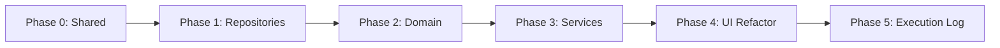

# Implementation Plan — Workflow 4-Layer Architecture Refactor

Based on [Improve_workflow.md](file:///f:/COD_CHECK/UI_MANAGER/improve/ACCOUNT_UI/Improve_workflow.md).

---

## Current State Analysis

### What Exists

| Layer | Current State |
|-------|--------------|
| **Backend Registry** | ✅ [workflow_registry.py](file:///f:/COD_CHECK/UI_MANAGER/backend/core/workflow/workflow_registry.py) — `FUNCTION_REGISTRY` (20 functions), `ACTIVITY_REGISTRY` (4 activities), [build_steps_for_activity()](file:///f:/COD_CHECK/UI_MANAGER/backend/core/workflow/workflow_registry.py#344-370) |
| **Backend Orchestrator** | ✅ [bot_orchestrator.py](file:///f:/COD_CHECK/UI_MANAGER/backend/core/workflow/bot_orchestrator.py) — per-activity status tracking, cooldown/limit, WS broadcast |
| **Backend API** | ✅ [api.py](file:///f:/COD_CHECK/UI_MANAGER/backend/api.py) — v2 config migration, activity-registry endpoint, bot status endpoints |
| **Frontend** | ❌ Monolithic `WF3` object (2241 LOC, 96 functions mixing UI + logic + data access) |

### WF3 Function Inventory (what needs migrating)

| Responsibility | Functions | Target Layer |
|---|---|---|
| **Data fetch** | [fetchFunctions](file:///f:/COD_CHECK/UI_MANAGER/frontend/js/pages/workflow.js#560-570), [fetchTemplates](file:///f:/COD_CHECK/UI_MANAGER/frontend/js/pages/workflow.js#598-607), [fetchRecipes](file:///f:/COD_CHECK/UI_MANAGER/frontend/js/pages/workflow.js#577-586), [fetchEmulators](file:///f:/COD_CHECK/UI_MANAGER/frontend/js/pages/workflow.js#587-605), [loadGroupsData](file:///f:/COD_CHECK/UI_MANAGER/frontend/js/pages/workflow.js#618-631), [loadAccountsData](file:///f:/COD_CHECK/UI_MANAGER/frontend/js/pages/workflow.js#628-637), [loadRegistry](file:///f:/COD_CHECK/UI_MANAGER/frontend/js/pages/workflow.js#659-679), [_loadConfigFromBackend](file:///f:/COD_CHECK/UI_MANAGER/frontend/js/pages/workflow.js#838-858) | Infrastructure |
| **Data persist** | [saveRecipe](file:///f:/COD_CHECK/UI_MANAGER/frontend/js/pages/workflow.js#1888-1916), [_saveConfigToBackend](file:///f:/COD_CHECK/UI_MANAGER/frontend/js/pages/workflow.js#824-837), [saveActivityConfig](file:///f:/COD_CHECK/UI_MANAGER/frontend/js/pages/workflow.js#780-798), [savePerActivityConfig](file:///f:/COD_CHECK/UI_MANAGER/frontend/js/pages/workflow.js#1384-1411), [saveMiscConfig](file:///f:/COD_CHECK/UI_MANAGER/frontend/js/pages/workflow.js#809-823) | Infrastructure |
| **Business logic** | [getActivityConfig](file:///f:/COD_CHECK/UI_MANAGER/frontend/js/pages/workflow.js#701-719), [getMiscConfig](file:///f:/COD_CHECK/UI_MANAGER/frontend/js/pages/workflow.js#799-808), [getPerActivityConfig](file:///f:/COD_CHECK/UI_MANAGER/frontend/js/pages/workflow.js#1357-1383), [_isOnCooldown](file:///f:/COD_CHECK/UI_MANAGER/frontend/js/pages/workflow.js#731-741), [_formatCooldownRemaining](file:///f:/COD_CHECK/UI_MANAGER/frontend/js/pages/workflow.js#741-752), [_getLastRun](file:///f:/COD_CHECK/UI_MANAGER/frontend/js/pages/workflow.js#785-792), [_setLastRun](file:///f:/COD_CHECK/UI_MANAGER/frontend/js/pages/workflow.js#792-795) | Domain |
| **Use-case orchestration** | [runBotActivities](file:///f:/COD_CHECK/UI_MANAGER/frontend/js/pages/workflow.js#949-1045), [stopBotActivities](file:///f:/COD_CHECK/UI_MANAGER/frontend/js/pages/workflow.js#1046-1066), [runWorkflow](file:///f:/COD_CHECK/UI_MANAGER/frontend/js/pages/workflow.js#2188-2238) | Application |
| **UI rendering** | [render](file:///f:/COD_CHECK/UI_MANAGER/frontend/js/pages/workflow.js#8-385), [renderListView](file:///f:/COD_CHECK/UI_MANAGER/frontend/js/pages/workflow.js#1332-1390), `renderEditorView`, [renderSteps](file:///f:/COD_CHECK/UI_MANAGER/frontend/js/pages/workflow.js#1618-1670), [renderActivitiesForGroup](file:///f:/COD_CHECK/UI_MANAGER/frontend/js/pages/workflow.js#940-974), [renderMiscForGroup](file:///f:/COD_CHECK/UI_MANAGER/frontend/js/pages/workflow.js#1310-1347), [renderAccountQueue](file:///f:/COD_CHECK/UI_MANAGER/frontend/js/pages/workflow.js#1067-1115), [showActivityConfig](file:///f:/COD_CHECK/UI_MANAGER/frontend/js/pages/workflow.js#1026-1112), [updateActivityGroupList](file:///f:/COD_CHECK/UI_MANAGER/frontend/js/pages/workflow.js#638-669), [_updateActivityStatuses](file:///f:/COD_CHECK/UI_MANAGER/frontend/js/pages/workflow.js#1119-1183), [_updateGroupStatusBadge](file:///f:/COD_CHECK/UI_MANAGER/frontend/js/pages/workflow.js#1197-1216) | UI/Page |
| **UI interaction** | [switchMainTab](file:///f:/COD_CHECK/UI_MANAGER/frontend/js/pages/workflow.js#504-529), [switchRightTab](file:///f:/COD_CHECK/UI_MANAGER/frontend/js/pages/workflow.js#522-533), [switchActivityTab](file:///f:/COD_CHECK/UI_MANAGER/frontend/js/pages/workflow.js#506-517), [toggleActivityGroup](file:///f:/COD_CHECK/UI_MANAGER/frontend/js/pages/workflow.js#670-685), [selectActivity](file:///f:/COD_CHECK/UI_MANAGER/frontend/js/pages/workflow.js#1412-1421), tab/view management | UI/Page |

---

## Phase 0: Shared Foundation

> [!IMPORTANT]
> All new modules use ES modules (`export`/`import`). Since this project uses vanilla JS served by FastAPI static files, we need a bundler or `<script type="module">`. Decide approach first.

### [NEW] [HttpClient.js](file:///f:/COD_CHECK/UI_MANAGER/frontend/js/shared/http/HttpClient.js)
Centralized fetch wrapper with error handling:
```javascript
export class HttpClient {
  async get(url) { /* fetch + json parse + error */ }
  async post(url, body) { /* fetch + json parse + error */ }
  async delete(url) { /* fetch + error */ }
}
```

### [NEW] [Result.js](file:///f:/COD_CHECK/UI_MANAGER/frontend/js/shared/result/Result.js)
Standardized return type for service layer:
```javascript
export class Result {
  static ok(data) { return { ok: true, data }; }
  static fail(error) { return { ok: false, error }; }
}
```

### [NEW] [EventBus.js](file:///f:/COD_CHECK/UI_MANAGER/frontend/js/shared/eventbus/EventBus.js)
Simple pub/sub for decoupling WS events from UI:
```javascript
export class EventBus {
  on(event, handler) {}
  emit(event, data) {}
  off(event, handler) {}
}
```

---

## Phase 1: Infrastructure Layer (Repositories)

Extract ALL [fetch()](file:///f:/COD_CHECK/UI_MANAGER/frontend/js/pages/workflow.js#577-586) and data access calls from WF3 into repository classes.

### [NEW] [WorkflowRepository.js](file:///f:/COD_CHECK/UI_MANAGER/frontend/js/infrastructure/workflow/repositories/WorkflowRepository.js)
- `getFunctions()` ← from `WF3.fetchFunctions`
- `getTemplates()` ← from `WF3.fetchTemplates`
- `getRecipes()` ← from `WF3.fetchRecipes`
- [saveRecipe(recipe)](file:///f:/COD_CHECK/UI_MANAGER/frontend/js/pages/workflow.js#1888-1916) ← from `WF3.saveRecipe`
- [deleteRecipe(id)](file:///f:/COD_CHECK/UI_MANAGER/frontend/js/pages/workflow.js#1826-1837) ← from inline fetch in WF3

### [NEW] [EmulatorRepository.js](file:///f:/COD_CHECK/UI_MANAGER/frontend/js/infrastructure/workflow/repositories/EmulatorRepository.js)
- `getAll()` ← from `WF3.fetchEmulators`
- `getOnline()` → filter by `is_running: true`

### [NEW] [GroupRepository.js](file:///f:/COD_CHECK/UI_MANAGER/frontend/js/infrastructure/workflow/repositories/GroupRepository.js)
- `getAll()` ← from `WF3.loadGroupsData`
- `getById(id)` → filter from cached list

### [NEW] [AccountRepository.js](file:///f:/COD_CHECK/UI_MANAGER/frontend/js/infrastructure/workflow/repositories/AccountRepository.js)
- `getAll()` ← from `WF3.loadAccountsData`
- `getByIds(ids)` → filter from cached list

### [NEW] [ActivityConfigRepository.js](file:///f:/COD_CHECK/UI_MANAGER/frontend/js/infrastructure/workflow/repositories/ActivityConfigRepository.js)
- [loadConfig(groupId)](file:///f:/COD_CHECK/UI_MANAGER/frontend/js/pages/workflow.js#838-858) ← from `WF3._loadConfigFromBackend`
- [saveConfig(groupId, config)](file:///f:/COD_CHECK/UI_MANAGER/frontend/js/pages/workflow.js#824-837) ← from `WF3._saveConfigToBackend`
- `getRegistry()` ← from `WF3.loadRegistry` (calls `/api/workflow/activity-registry`)

### [NEW] [BotRepository.js](file:///f:/COD_CHECK/UI_MANAGER/frontend/js/infrastructure/workflow/repositories/BotRepository.js)
- [start(payload)](file:///f:/COD_CHECK/UI_MANAGER/backend/core/workflow/bot_orchestrator.py#96-278) ← from [fetch('/api/bot/run-sequential')](file:///f:/COD_CHECK/UI_MANAGER/frontend/js/pages/workflow.js#577-586) in [runBotActivities](file:///f:/COD_CHECK/UI_MANAGER/frontend/js/pages/workflow.js#949-1045)
- [stop(groupId)](file:///f:/COD_CHECK/UI_MANAGER/backend/core/workflow/bot_orchestrator.py#75-78) ← from [fetch('/api/bot/stop')](file:///f:/COD_CHECK/UI_MANAGER/frontend/js/pages/workflow.js#577-586) in [stopBotActivities](file:///f:/COD_CHECK/UI_MANAGER/frontend/js/pages/workflow.js#1046-1066)
- `getStatus(groupId?)` ← from [fetch('/api/bot/status')](file:///f:/COD_CHECK/UI_MANAGER/frontend/js/pages/workflow.js#577-586)
- `getAllStatuses()` ← from [fetch('/api/bot/status')](file:///f:/COD_CHECK/UI_MANAGER/frontend/js/pages/workflow.js#577-586) (no group_id)

### [NEW] [ExecutionRepository.js](file:///f:/COD_CHECK/UI_MANAGER/frontend/js/infrastructure/workflow/repositories/ExecutionRepository.js)
- [run(emulatorIndex, steps)](file:///f:/COD_CHECK/UI_MANAGER/backend/api.py#123-157) ← from [fetch('/api/workflow/run')](file:///f:/COD_CHECK/UI_MANAGER/frontend/js/pages/workflow.js#577-586) in [runWorkflow](file:///f:/COD_CHECK/UI_MANAGER/frontend/js/pages/workflow.js#2188-2238)

---

## Phase 2: Domain Layer (Pure Logic)

Extract business rules into pure functions/classes that do NOT touch DOM or fetch.

### [NEW] [ActivitySelectionPolicy.js](file:///f:/COD_CHECK/UI_MANAGER/frontend/js/domain/workflow/policies/ActivitySelectionPolicy.js)
- `pickEnabled(systemActivities, groupConfig)` → returns `ActivityConfig[]` with enabled flag ← from [getActivityConfig](file:///f:/COD_CHECK/UI_MANAGER/frontend/js/pages/workflow.js#701-719)
- `pickReady(enabled, groupConfig)` → filter out cooldown activities ← from cooldown filtering in [runBotActivities](file:///f:/COD_CHECK/UI_MANAGER/frontend/js/pages/workflow.js#949-1045)

### [NEW] [CooldownPolicy.js](file:///f:/COD_CHECK/UI_MANAGER/frontend/js/domain/workflow/policies/CooldownPolicy.js)
- [isOnCooldown(activityId, config)](file:///f:/COD_CHECK/UI_MANAGER/frontend/js/pages/workflow.js#731-741) ← from [_isOnCooldown](file:///f:/COD_CHECK/UI_MANAGER/frontend/js/pages/workflow.js#731-741)
- `formatRemaining(activityId, config)` ← from [_formatCooldownRemaining](file:///f:/COD_CHECK/UI_MANAGER/frontend/js/pages/workflow.js#741-752)
- [getLastRun(activityId, config)](file:///f:/COD_CHECK/UI_MANAGER/frontend/js/pages/workflow.js#785-792) ← from [_getLastRun](file:///f:/COD_CHECK/UI_MANAGER/frontend/js/pages/workflow.js#785-792)

### [NEW] [RecipePolicy.js](file:///f:/COD_CHECK/UI_MANAGER/frontend/js/domain/workflow/policies/RecipePolicy.js)
- `validate(recipe)` → check name not empty, steps not empty
- `validateStep(step)` → check function_id exists

### [NEW] [WorkflowRunPolicy.js](file:///f:/COD_CHECK/UI_MANAGER/frontend/js/domain/workflow/policies/WorkflowRunPolicy.js)
- `validate(command)` → check emulator selected, steps not empty

### [NEW] [BotPayloadBuilder.js](file:///f:/COD_CHECK/UI_MANAGER/frontend/js/domain/workflow/policies/BotPayloadBuilder.js)
- [build(groupId, readyActivities, miscConfig, perActivityConfigs)](file:///f:/COD_CHECK/UI_MANAGER/backend/api.py#837-843) → returns clean API payload ← from payload building in [runBotActivities](file:///f:/COD_CHECK/UI_MANAGER/frontend/js/pages/workflow.js#949-1045)

### [NEW] [DomainError.js](file:///f:/COD_CHECK/UI_MANAGER/frontend/js/domain/workflow/errors/DomainError.js)
- Simple error class with `code` + `message`

---

## Phase 3: Application Layer (Services)

Orchestrate use-cases: service calls domain logic + repositories, returns Result.

### [NEW] [LoadWorkflowScreenService.js](file:///f:/COD_CHECK/UI_MANAGER/frontend/js/application/workflow/services/LoadWorkflowScreenService.js)
- [execute()](file:///f:/COD_CHECK/UI_MANAGER/backend/core/workflow/executor.py#10-260) → parallel fetch functions, templates, recipes, emulators, groups, accounts, registry → returns ViewModel DTO

### [NEW] [SaveRecipeService.js](file:///f:/COD_CHECK/UI_MANAGER/frontend/js/application/workflow/services/SaveRecipeService.js)
- [execute(cmd)](file:///f:/COD_CHECK/UI_MANAGER/backend/core/workflow/executor.py#10-260) → validate via RecipePolicy → save via WorkflowRepository → return Result

### [NEW] [RunWorkflowService.js](file:///f:/COD_CHECK/UI_MANAGER/frontend/js/application/workflow/services/RunWorkflowService.js)
- [execute(cmd)](file:///f:/COD_CHECK/UI_MANAGER/backend/core/workflow/executor.py#10-260) → validate via WorkflowRunPolicy → run via ExecutionRepository → return Result

### [NEW] [RunBotActivitiesService.js](file:///f:/COD_CHECK/UI_MANAGER/frontend/js/application/workflow/services/RunBotActivitiesService.js)
- [execute(groupId, groupConfigs, systemActivities)](file:///f:/COD_CHECK/UI_MANAGER/backend/core/workflow/executor.py#10-260) → pick enabled → check cooldowns → build payload → call BotRepository.start → return Result

### [NEW] [StopBotService.js](file:///f:/COD_CHECK/UI_MANAGER/frontend/js/application/workflow/services/StopBotService.js)
- [execute(groupId)](file:///f:/COD_CHECK/UI_MANAGER/backend/core/workflow/executor.py#10-260) → call BotRepository.stop → return Result

### [NEW] [SaveActivityConfigService.js](file:///f:/COD_CHECK/UI_MANAGER/frontend/js/application/workflow/services/SaveActivityConfigService.js)
- [execute(groupId, config)](file:///f:/COD_CHECK/UI_MANAGER/backend/core/workflow/executor.py#10-260) → save via ActivityConfigRepository → return Result

---

## Phase 4: UI/Page Layer Refactor

### [MODIFY] [workflow.js](file:///f:/COD_CHECK/UI_MANAGER/frontend/js/pages/workflow.js)
Strangler pattern — gradually replace WF3 methods:

1. **Wire up DI container** at init:
   ```javascript
   const http = new HttpClient();
   const workflowRepo = new WorkflowRepository(http);
   const botRepo = new BotRepository(http);
   // ... etc
   const runBotService = new RunBotActivitiesService({ botRepo, configRepo });
   ```

2. **Replace methods one by one:**
   - [fetchFunctions()](file:///f:/COD_CHECK/UI_MANAGER/frontend/js/pages/workflow.js#560-570) → `this.workflowRepo.getFunctions()`
   - [runBotActivities()](file:///f:/COD_CHECK/UI_MANAGER/frontend/js/pages/workflow.js#949-1045) → `this.runBotService.execute(groupId, ...)`
   - [saveRecipe()](file:///f:/COD_CHECK/UI_MANAGER/frontend/js/pages/workflow.js#1888-1916) → `this.saveRecipeService.execute(cmd)`
   - etc.

3. **Eventually split into:**
   - [WorkflowPage.js](file:///f:/COD_CHECK/UI_MANAGER/frontend/js/pages/workflow/WorkflowPage.js) — rendering only
   - [WorkflowEventBinder.js](file:///f:/COD_CHECK/UI_MANAGER/frontend/js/pages/workflow/WorkflowEventBinder.js) — DOM event → service calls

---

## Phase 5: Execution Logging (For Task Page Reuse)

### Backend

#### [NEW] [execution_log.py](file:///f:/COD_CHECK/UI_MANAGER/backend/core/workflow/execution_log.py)
- `create_run(meta)` → INSERT into [task_runs](file:///f:/COD_CHECK/UI_MANAGER/backend/storage/database.py#1052-1075) table
- `append_step_log(run_id, step_log)` → INSERT into `task_run_steps`
- `complete_run(run_id, summary)` → UPDATE [task_runs](file:///f:/COD_CHECK/UI_MANAGER/backend/storage/database.py#1052-1075) with end_at, status

#### [MODIFY] [bot_orchestrator.py](file:///f:/COD_CHECK/UI_MANAGER/backend/core/workflow/bot_orchestrator.py)
- Call `create_run()` at start, `append_step_log()` per activity, `complete_run()` at end

#### [NEW] DB Migration
```sql
CREATE TABLE task_runs (
  run_id TEXT PRIMARY KEY,
  source_page TEXT, trigger_type TEXT, triggered_by TEXT,
  target_id INTEGER, status TEXT,
  start_at TEXT, end_at TEXT, duration_ms INTEGER,
  metadata_json TEXT
);

CREATE TABLE task_run_steps (
  id INTEGER PRIMARY KEY AUTOINCREMENT,
  run_id TEXT, step_index INTEGER, function_id TEXT,
  input_json TEXT, output_json TEXT, status TEXT,
  error_code TEXT, error_message TEXT,
  started_at TEXT, ended_at TEXT, latency_ms INTEGER
);
```

### Frontend

#### [NEW] [ExecutionLogRepository.js](file:///f:/COD_CHECK/UI_MANAGER/frontend/js/infrastructure/workflow/repositories/ExecutionLogRepository.js)
- `getRunHistory(filters)` → GET `/api/execution/runs`
- `getRunDetail(runId)` → GET `/api/execution/runs/{runId}`

---

## Migration Strategy (Strangler Pattern)



1. Each phase creates **new modules alongside WF3 monolith**.
2. WF3 methods are gradually delegated to new modules.
3. After Phase 4, WF3 becomes a thin shell calling services.
4. Final cleanup: split WF3 into `WorkflowPage.js` + remove dead code.

> [!CAUTION]
> During migration, WF3 and new modules coexist. No feature freeze needed — just don't add NEW logic to WF3, only to new layer modules.

---

## Folder Structure (Final)

```
frontend/js/
├── shared/
│   ├── http/HttpClient.js
│   ├── result/Result.js  
│   └── eventbus/EventBus.js
├── domain/workflow/
│   ├── policies/
│   │   ├── ActivitySelectionPolicy.js
│   │   ├── CooldownPolicy.js
│   │   ├── RecipePolicy.js
│   │   ├── WorkflowRunPolicy.js
│   │   └── BotPayloadBuilder.js
│   └── errors/DomainError.js
├── application/workflow/services/
│   ├── LoadWorkflowScreenService.js
│   ├── SaveRecipeService.js
│   ├── RunWorkflowService.js
│   ├── RunBotActivitiesService.js
│   ├── StopBotService.js
│   └── SaveActivityConfigService.js
├── infrastructure/workflow/repositories/
│   ├── WorkflowRepository.js
│   ├── EmulatorRepository.js
│   ├── GroupRepository.js
│   ├── AccountRepository.js
│   ├── ActivityConfigRepository.js
│   ├── BotRepository.js
│   ├── ExecutionRepository.js
│   └── ExecutionLogRepository.js
└── pages/
    └── workflow/
        ├── WorkflowPage.js
        └── WorkflowEventBinder.js
```

---

## Verification Plan

### Per Phase
- Phase 0-1: All existing API calls work through repositories
- Phase 2: Domain policies return correct results (pure unit tests)
- Phase 3: Services orchestrate correctly (mock repo tests)
- Phase 4: UI renders identically, no regression
- Phase 5: Execution logs written to DB, queryable

### Integration
- Full workflow cycle: load page → select group → enable activities → start bot → status updates → stop bot
- Recipe Builder: create → save → run → check WS logs
