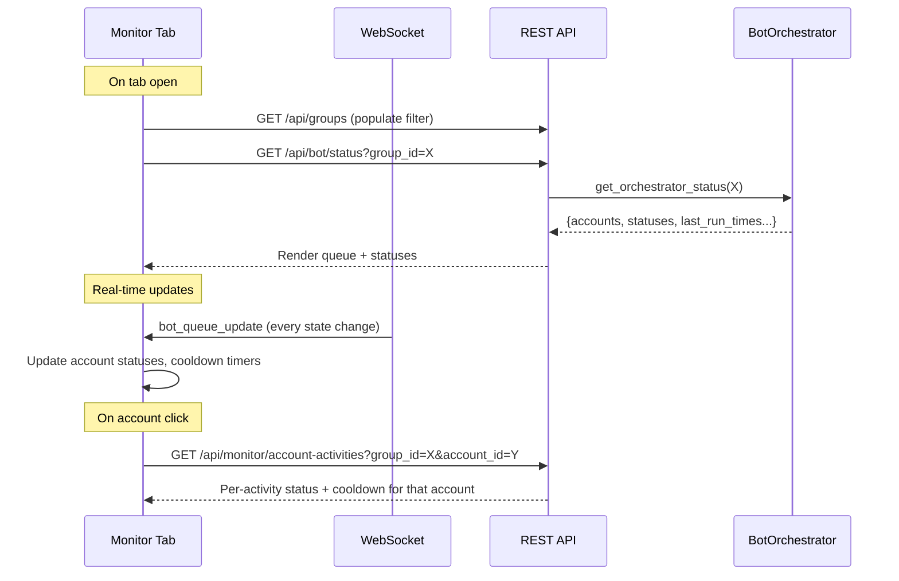

# Workflow Monitor Tab — UI Design Specification

> **Vị trí**: Tab thứ 4 trong Workflow page, cạnh "Account Groups"  
> **Tên tab**: `Monitor` (hoặc `Live Monitor`)  
> **Mục đích**: Cho phép user thấy được **ý định của hệ thống** khi đang chạy workflow — account nào đã chạy, đang chạy, sẽ chạy — và cooldown đang đếm ngược.


---

## 1. Tab Placement

```
┌─────────────────────────────────────────────────────────────┐
│  Activity (Bot)  │  Recipe Builder  │  Account Groups  │  Monitor  │
└─────────────────────────────────────────────────────────────┘
```

- Thêm tab **"Monitor"** (icon: 📊) ngay sau "Account Groups"
- Khi click → render nội dung Monitor thay cho panel chính
- Tab hiển thị badge đỏ khi có orchestrator đang chạy (🟢)

---

## 2. Layout Overview

```
┌──────────────────────────────────────────────────────────────────────────────┐
│ [Filter: Target Group ▼ TEST]    [Cycle: 3]  [Status: 🟢 Running]          │
├────────────────────────────────────┬─────────────────────────────────────────┤
│                                    │                                         │
│   ACCOUNT QUEUE (reorder list)     │    ACTIVITY DETAIL                      │
│   (Left panel ~40%)               │    (Right panel ~60%)                   │
│                                    │                                         │
│   ┌─ EMU 1 ──────────────────┐    │    Selected account's activities        │
│   │ 🟢 Goten   [Done] 10m ago│    │    with per-activity status & cooldown  │
│   │ ⏳ Roshi   [CD 12m]      │    │                                         │
│   ├─ EMU 2 ──────────────────┤    │                                         │
│   │ ▶️ ChiChi  [Running]     │    │                                         │
│   │ ⏳ King Kai [CD 45m]     │    │                                         │
│   ├─ EMU 4 ──────────────────┤    │                                         │
│   │ ⏳ Gohan   [Smart Wait]  │    │                                         │
│   │ ⬜ Buu     [Pending]     │    │                                         │
│   └──────────────────────────┘    │                                         │
│                                    │                                         │
├────────────────────────────────────┴─────────────────────────────────────────┤
│ TIMELINE / LOG (collapsible bottom panel)                                    │
│ 03:29 Buu → Swap done on Emu 4 | 03:31 Gohan → Smart Wait 3m | ...         │
└──────────────────────────────────────────────────────────────────────────────┘
```

---

## 3. Top Bar — Filter & Global Status

### 3.1 Group Filter Dropdown
- Label: **"Target Group"**
- Dropdown chứa tất cả groups từ `GET /api/groups`
- Khi chọn group → gọi `GET /api/bot/status?group_id=X` → render data
- Default: chọn group đang có orchestrator running (nếu có)

### 3.2 Global Status Indicators (cùng hàng, bên phải)
| Indicator | Ý nghĩa | Data source |
|-----------|---------|-------------|
| 🟢 Running / 🔴 Stopped / 🟡 Cooldown | Trạng thái bot | `is_running`, `stop_requested`, `all_on_cooldown` |
| Cycle: `N` | Cycle hiện tại | `cycle` |
| Account: `3/12` | Progress (current_idx / total) | `current_idx`, `total_accounts` |
| Smart Wait: `2m 30s` | Nếu đang smart wait | Cần thêm vào `broadcast_state` |

---

## 4. Left Panel — Account Queue (Reorder List)

### 4.1 Nguồn dữ liệu
- **Chính**: `broadcast_state` → `accounts[]` array (đã theo thứ tự queue thực tế)
- Mỗi account có: `id`, `lord_name`, `emu_index`, `status`
- **Bổ sung**: `last_run_times` (cần expose từ backend) để tính cooldown countdown

### 4.2 Group by Emulator
Tách danh sách accounts thành nhóm theo `emu_index`:
```
── EMU 1 ─────────────────────
   1. Goten          ✅ Done     (ran 10m ago)
   2. Master Roshi   ⏳ CD 12m   (next in 12m)
── EMU 2 ─────────────────────
   3. ChiChi         ▶️ Running  (Catch Pet...)
   4. King Kai       ⬜ Pending  
── EMU 3 ─────────────────────
   ...
```

### 4.3 Account Row Design

```
┌────────────────────────────────────────────────┐
│ [#] [Avatar] Lord Name       [Status Badge]    │
│              Emu N · ID 16025767               │
│              Last: 10m ago  CD: ⏳ 12:34       │
└────────────────────────────────────────────────┘
```

| Element | Chi tiết |
|---------|---------|
| **#** | Thứ tự trong queue (1, 2, 3...) — thể hiện reorder list thực tế |
| **Lord Name** | Tên account (`lord_name` hoặc fallback `game_id`) |
| **Sub-info** | `Emu {N}` · `game_id` |
| **Status Badge** | Một trong các trạng thái bên dưới |
| **Cooldown Timer** | Đếm ngược real-time (JS `setInterval` mỗi 1s), format `MM:SS` |
| **Last Run** | "10m ago", "Just now", "Never" |

### 4.4 Status Badges
| Status | Badge | Màu | Điều kiện |
|--------|-------|-----|-----------|
| `running` | ▶️ Running | Green (`--emerald-500`) | `current_idx` trỏ vào account này |
| `done` | ✅ Done | Green nhạt | Account đã chạy xong trong cycle này |
| `pending` | ⬜ Pending | Gray | Chưa đến lượt |
| `cooldown` | ⏳ CD `MM:SS` | Amber (`--amber-500`) | Đang cooldown, hiện countdown |
| `smart_wait` | 🔄 Waiting `MM:SS` | Blue (`--blue-500`) | Đang smart wait (threshold) |
| `error` | ❌ Error | Red (`--red-500`) | Swap failed hoặc activity lỗi |
| `skipped` | ⏭️ Skipped | Gray nhạt | Bị skip (no emu, no game_id...) |

### 4.5 Visual Highlighting
- Account **đang running**: border-left 3px solid green, background highlight nhẹ
- Account **ngay sau running** (next in queue): border-left 3px dashed blue, label "Next"
- Account group header (EMU N): sticky, background tối hơn

### 4.6 Click Interaction
- Click vào 1 account → right panel hiển thị **Activity Detail** cho account đó

---

## 5. Right Panel — Activity Detail

Khi click 1 account ở panel trái, panel phải hiển thị danh sách activities **đã config cho group này** cùng trạng thái per-account.

### 5.1 Header
```
┌─────────────────────────────────────────┐
│ 👤 dragonball Gohan                     │
│ Emu 4 · ID 11300640                    │
│ Status: ⏳ Cooldown (2m 15s remaining) │
└─────────────────────────────────────────┘
```

### 5.2 Activity List
```
┌─────────────────────────────────────────────────────┐
│ Activity Name          Status      Last Run   CD    │
├─────────────────────────────────────────────────────┤
│ ✅ Gather Resource     Done        2m ago     —     │
│ ✅ Catch Pet           Done        5m ago     —     │
│ ⏳ Claim Mail          Cooldown    45m ago    15:23 │
│ ⬜ Train Troops        Pending     1h ago     —     │
│ ❌ Full Scan           Error       3h ago     —     │
└─────────────────────────────────────────────────────┘
```

| Column | Data Source |
|--------|------------|
| Activity Name | Từ `activities` config của group |
| Status | `activity_statuses[activity_id]` từ `broadcast_state`, hoặc cooldown check |
| Last Run | `account_activity_logs` table (per account + per activity) |
| CD (Cooldown) | Nếu `cooldown_enabled` && last_run + cooldown_minutes > now → show countdown |

### 5.3 Empty State
Khi chưa chọn account: hiển thị hint text "Select an account from the queue to view its activity details."

---

## 6. Bottom Panel — Event Timeline (Optional, Collapsible)

Dải log ngang dưới cùng, collapsible (mặc định collapsed để tiết kiệm space).

### 6.1 Nội dung
Hiển thị **swap events** và **activity events** real-time (từ WebSocket events `bot_queue_update`, `activity_started`, `activity_completed`, `activity_failed`).

### 6.2 Format
```
[03:29:38] 🔄 Emu 4: Swapped to Buu (16025767) — attempt 1/3
[03:30:57] ✅ Emu 4: Buu verified — match on attempt 1
[03:31:14] 📋 Queue reorder: Buu moved to front of Emu 4 group (cycle_end)
[03:31:16] 🔄 Emu 4: Swapping to Gohan (11300640)...
[03:32:22] ✅ Emu 4: Gohan verified — running activities
```

### 6.3 Toggle
- Button "Show Timeline ▼" / "Hide Timeline ▲" 
- Persist state in localStorage

---

## 7. Backend API Changes Required

### 7.1 Extend `broadcast_state` (WebSocket)

Thêm fields vào object `data` tại `bot_orchestrator.py` line 110:

```python
data = {
    # ... existing fields ...
    "last_run_times": self.last_run_times,          # NEW: dict {acc_id: timestamp}
    "misc_config": {                                 # NEW: expose active config
        "cooldown_min": self.misc_config.get("cooldown_min", 0),
        "swap_wait_threshold_min": self.misc_config.get("swap_wait_threshold_min", 0),
    },
    "smart_wait_active": {                           # NEW: if currently smart-waiting
        "account_id": <acc_id or null>,
        "remaining_sec": <float or null>,
    },
}
```

### 7.2 Extend `get_orchestrator_status` (REST)

Thêm cùng fields vào `get_orchestrator_status()` tại line 1162 để REST polling cũng có data.

### 7.3 New API: Per-Account Activity History

```
GET /api/monitor/account-activities?group_id=X&account_id=Y
```

Response:
```json
{
  "activities": [
    {
      "activity_id": "gather_resource_center",
      "activity_name": "Gather Resource Center",
      "enabled": true,
      "last_run": "2026-03-13T03:15:00",
      "status": "SUCCESS",
      "cooldown_enabled": true,
      "cooldown_minutes": 60,
      "cooldown_remaining_sec": 1523,
      "runs_today": 4
    }
  ]
}
```

Data source: `account_activity_logs` table + `activity_configs/{group_id}.json`.

---

## 8. Data Flow Summary



---

## 9. Real-time Cooldown Timer Logic (Frontend)

```javascript
// Pseudo-code for cooldown countdown
function updateCooldownTimers(lastRunTimes, cooldownMin) {
    const cooldownSec = cooldownMin * 60;
    const now = Date.now() / 1000; // epoch seconds
    
    for (const [accId, lastRun] of Object.entries(lastRunTimes)) {
        const elapsed = now - lastRun;
        const remaining = cooldownSec - elapsed;
        
        if (remaining > 0) {
            // Show countdown: formatTime(remaining) → "12:34"
            updateBadge(accId, 'cooldown', formatTime(remaining));
        } else {
            updateBadge(accId, 'ready', null);
        }
    }
}

// Run every 1 second
setInterval(() => updateCooldownTimers(lastRunTimes, cooldownMin), 1000);
```

---

## 10. Responsive & Polish

| Aspect | Spec |
|--------|------|
| **Auto-refresh** | WebSocket push (primary), REST polling fallback every 3s |
| **Auto-scroll** | Queue panel auto-scrolls to keep running account visible |
| **Idle state** | When bot is not running: show "Bot is idle. Start from Activity (Bot) tab." |
| **Loading** | Skeleton loader while fetching initial data |
| **No group selected** | "Select a target group to monitor its workflow." |
| **Animations** | Smooth status badge transitions (fade), countdown number changes (no flicker) |
| **Dark mode** | Sử dụng CSS variables hiện có (`--bg`, `--border`, `--text`, etc.) |

---

## 11. File Structure (Suggested)

| File | Purpose |
|------|---------|
| `frontend/js/pages/workflow.js` | Add Monitor tab rendering + logic (hoặc tách file riêng) |
| `frontend/css/pages/workflow-monitor.css` | Styles cho Monitor tab |
| `backend/api.py` | Add `/api/monitor/account-activities` endpoint |
| `backend/core/workflow/bot_orchestrator.py` | Extend `broadcast_state` + `get_orchestrator_status` |
