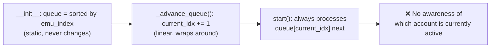

# Smart Swap Account Queue

## Problem

Queue hiện tại sorted **tĩnh** theo `emu_index` lúc init:

```
Queue: [A(emu0), B(emu0), C(emu1), D(emu1)]
         ↑ luôn bắt đầu từ A
```

**Scenario lãng phí:**

```
Cycle 1: Login A → run → swap B → run → done (emu đang login B)
Cycle 2: Swap A ← lãng phí! → run → swap B → run
         ↑ swap thừa vì B đang active
```

**Mong muốn:**

```
Cycle 2: B đang active → run B trước → swap A → run A
         ↑ chỉ 1 swap thay vì 2
```

---

## Root Cause



Queue **không bao giờ reorder** dựa trên account đang active. [_advance_queue()](file:///f:/COD_CHECK/UI_MANAGER/backend/core/workflow/bot_orchestrator.py#843-855) chỉ tăng index tuyến tính.

---

## Proposed Changes

### Component: Bot Orchestrator

#### [MODIFY] [bot_orchestrator.py](file:///f:/COD_CHECK/UI_MANAGER/backend/core/workflow/bot_orchestrator.py)

**Thay đổi 1 — Thêm method `_reorder_queue_for_active_account()`:**

Ở **đầu mỗi cycle mới** (khi [_advance_queue()](file:///f:/COD_CHECK/UI_MANAGER/backend/core/workflow/bot_orchestrator.py#843-855) wraps `current_idx` về 0), reorder queue sao cho account đang active của từng emulator group được đẩy lên đầu group:

```python
def _reorder_queue_for_active_account(self, last_account_id: str):
    """Reorder queue so the currently-active account on each emulator
    runs first, minimizing unnecessary swaps.
    
    Groups accounts by emu_index, then within each group:
    - If the active account is in this group → move it to front
    - Otherwise → keep original order
    
    Preserves cross-emulator ordering (emu0 accounts before emu1).
    """
```

**Logic:**

```
Input:  queue = [A(emu0), B(emu0), C(emu1), D(emu1)]
        last_account_id = B.game_id

Step 1: Group by emu_index
        emu0: [A, B]    emu1: [C, D]

Step 2: Trong emu0 group, B đang active → đẩy B lên đầu
        emu0: [B, A]    emu1: [C, D]

Step 3: Flatten lại
        queue = [B(emu0), A(emu0), C(emu1), D(emu1)]
```

**Thay đổi 2 — Gọi reorder trong [_advance_queue()](file:///f:/COD_CHECK/UI_MANAGER/backend/core/workflow/bot_orchestrator.py#843-855):**

```diff
 def _advance_queue(self):
     self.current_idx += 1
     if self.current_idx >= len(self.queue):
         self.current_idx = 0
         self.cycle += 1
+        # Smart reorder: prioritize currently-active account to avoid swap-back
+        self._reorder_queue_for_active_account()
         for key in self.account_statuses:
             self.account_statuses[key] = "pending"
```

**Thay đổi 3 — Early read tại đầu cycle 1 để reorder ngay lần chạy đầu:**

Bạn đúng — [_ensure_correct_account()](file:///f:/COD_CHECK/UI_MANAGER/backend/core/workflow/bot_orchestrator.py#343-407) đã gọi [_read_live_account_id()](file:///f:/COD_CHECK/UI_MANAGER/backend/core/workflow/bot_orchestrator.py#280-328) ngay lần đầu. Vấn đề là lúc đó đã "quá muộn" vì orchestrator đã chọn `queue[0]` để xử lý rồi.

**Giải pháp: Thêm early probe** ngay sau khi emulator boot + lobby ready, TRƯỚC khi xử lý account đầu tiên:

```python
# Inside start(), right after first _ensure_lobby() succeeds
# and BEFORE processing queue[current_idx]

if last_account_id is None and lobby_ok:
    # Early probe: read who is currently logged in
    probe = await self._read_live_account_id(serial, detector, "smart queue probe")
    if probe["account_id"]:
        last_account_id = probe["account_id"]
        print(f"[BotOrchestrator] Smart Queue: detected active account {last_account_id}")
        self._reorder_queue_for_active_account(last_account_id)
        # Check if current account changed after reorder
        acc = self.queue[self.current_idx]  # refresh
```

Như vậy cycle 1 cũng được hưởng lợi. Flow trở thành:

```
Cycle 1:
  Boot emu → Lobby → Early probe: "B đang active"
  → Reorder [B, A] → Run B (no swap!) → Swap A → Run A
```

> [!NOTE]
> Early probe tốn thêm ~5-8s (go_to_profile → extract_id → back_to_lobby). Nhưng tiết kiệm được 30-60s swap account. Chấp nhận trade-off.

> [!NOTE]
> **Không ảnh hưởng cross-emu ordering.** Reorder chỉ xảy ra **trong cùng emu_index group**. Thứ tự giữa các emulator khác nhau không đổi.

---

### Cooldown Edge Case Analysis

> **Scenario:** Cycle 1 chạy A trước → B sau. `last_account_id = B`. Cycle 2 reorder thành [B, A].
> Nhưng B chưa cooldown xong còn A đã cooldown xong → chuyện gì xảy ra?

**Trả lời: Hoàn toàn an toàn.** Trace flow:

```
Cycle 2 bắt đầu:
  Queue: [B, A]  (reordered, B đang active)

  Iteration 1: Xử lý B
    → Check cooldown (line 468-506)
    → B chưa hết cooldown → SKIP (continue)
    → ❌ Không swap, không boot, không làm gì cả
    → _advance_queue() → chuyển sang A

  Iteration 2: Xử lý A  
    → Check cooldown → A đã hết cooldown → ✅
    → _ensure_correct_account() → B đang active, cần swap sang A
    → Swap B→A (1 swap — giống hệt nếu không reorder)
    → Run A activities
```

**Kết luận:** Cooldown check xảy ra **trước mọi thao tác** (trước cả lobby/swap). Account bị cooldown chỉ bị skip nhẹ (`continue`), không tốn thời gian. Reorder không gây thêm swap nào.

**NHƯNG** — có thể tối ưu thêm với **Smart Wait**:

---

### Thay đổi 4 — Smart Wait Threshold (Configurable)

**Scenario:** B đang active, B còn cooldown 10 phút, A đã hết cooldown. Nếu swap A ngay → chạy A → rồi lại swap B → 2 swap. Nếu **đợi 10 phút** rồi chạy B luôn → chỉ cần 1 swap sau (B→A).

**Logic:** Khi gặp account trên cooldown mà đang là active account, kiểm tra: nếu thời gian cooldown còn lại ≤ `swap_wait_threshold_min` (config), **đợi** rồi chạy luôn thay vì skip.

```python
# Inside start(), in the cooldown check block (line ~468-506)

remaining_cd = cooldown_sec - (time.time() - last_run)
swap_wait_threshold = self.misc_config.get("swap_wait_threshold_min", 0) * 60

# Smart Wait: if this account is already active AND cooldown finishes soon → wait
if (
    swap_wait_threshold > 0
    and remaining_cd <= swap_wait_threshold
    and last_account_id == expected_game_id  # this account is currently logged in
):
    print(
        f"[BotOrchestrator] Smart Wait: {acc_id} is active and cooldown ends in "
        f"{remaining_cd/60:.1f}m (threshold: {swap_wait_threshold/60:.0f}m). Waiting..."
    )
    # Sleep in chunks to respect stop_requested
    while remaining_cd > 0 and not self.stop_requested:
        chunk = min(remaining_cd, 10)
        await asyncio.sleep(chunk)
        remaining_cd -= chunk
    # After wait → fall through to normal processing (no skip)
else:
    # Normal cooldown skip
    consecutive_skips += 1
    ...
    continue
```

**Config schema (trong `misc_config`):**

| Key | Type | Default | Mô tả |
|-----|------|---------|-------|
| `swap_wait_threshold_min` | int | `0` (disabled) | Nếu active account còn cooldown ≤ X phút → đợi thay vì swap |

> [!TIP]
> Đặt `swap_wait_threshold_min = 0` để tắt feature này (behaviour cũ). Gợi ý giá trị: 15-30 phút tuỳ workflow.

---

## Visualization

### Before (hiện tại)

```
Cycle 1: [A→swap] [B→swap] [C→swap] [D→swap]
                                        ↑ emu login D
Cycle 2: [A→swap!] [B→swap] [C→swap!] [D→swap]
           ↑ unnecessary swap-back         ↑ unnecessary swap-back
Total swaps per cycle: 4 (worst case)
```

### After (smart)

```
Cycle 1: [A→swap] [B→no swap] [C→swap] [D→no swap]
                                           ↑ emu login D
Cycle 2: Queue reordered: [B, A, D, C]
         [B→no swap!] [A→swap] [D→no swap!] [C→swap]
           ↑ B still active      ↑ D still active
Total swaps per cycle: 2 (halved!)
```

---

## Verification Plan

### Unit Test

Test `_reorder_queue_for_active_account()` trực tiếp:

| Scenario | Queue Before | Active ID | Queue After |
|----------|-------------|-----------|-------------|
| Active B trên emu0 | A(emu0), B(emu0), C(emu1) | B.game_id | **B**, A, C |
| Active D trên emu1 | A(emu0), B(emu0), C(emu1), D(emu1) | D.game_id | A, B, **D**, C |
| Active unknown | A, B, C | "xyz" | A, B, C (no change) |
| Single account per emu | A(emu0), B(emu1) | B.game_id | A, B (no change needed) |
| All same emu | A(emu0), B(emu0), C(emu0) | C.game_id | **C**, A, B |

### Manual Verification

Chạy bot với 2 accounts trên cùng emulator qua 2+ cycles, kiểm tra logs:

- Cycle 1: swap bình thường (A → B)
- Cycle 2: log phải show **"Smart reorder"** và B chạy trước, chỉ 1 swap (B→A) thay vì 2
