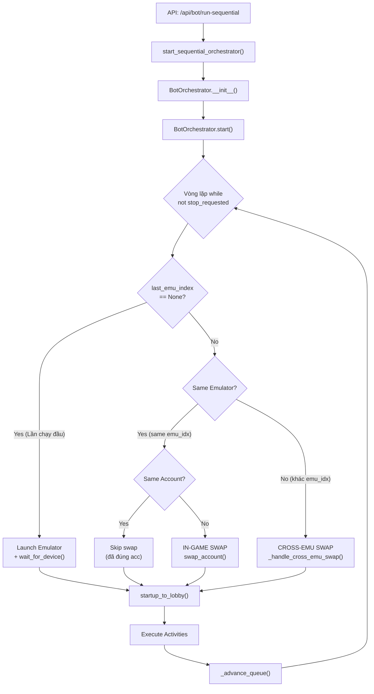
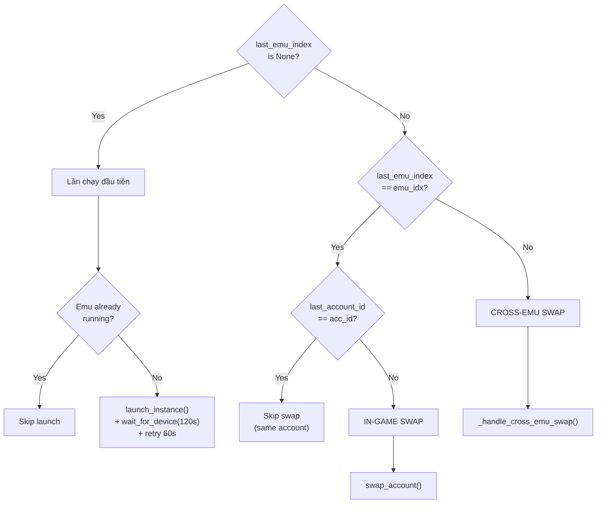
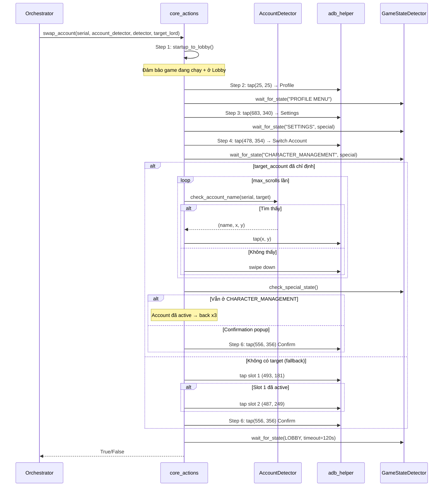

# Bot Orchestrator — Cơ chế Swap Account & Swap Emulator

Tài liệu mô tả chi tiết luồng xử lý đổi Account và đổi Emulator trong hệ thống Bot Orchestrator.

---

## Tổng quan kiến trúc



---

## File & Function Map

| File | Function | Vai trò |
|------|----------|---------|
| [bot_orchestrator.py](file:///f:/COD_CHECK/UI_MANAGER/backend/core/workflow/bot_orchestrator.py) | `BotOrchestrator.start()` | Vòng lặp chính, điều phối toàn bộ |
| [bot_orchestrator.py](file:///f:/COD_CHECK/UI_MANAGER/backend/core/workflow/bot_orchestrator.py#L215-L245) | [_handle_cross_emu_swap()](file:///f:/COD_CHECK/UI_MANAGER/backend/core/workflow/bot_orchestrator.py#215-246) | Tắt Emu cũ, bật Emu mới |
| [bot_orchestrator.py](file:///f:/COD_CHECK/UI_MANAGER/backend/core/workflow/bot_orchestrator.py#L662-L674) | [_advance_queue()](file:///f:/COD_CHECK/UI_MANAGER/backend/core/workflow/bot_orchestrator.py#662-674) | Tăng index, chuyển cycle |
| [core_actions.py](file:///f:/COD_CHECK/UI_MANAGER/backend/core/workflow/core_actions.py#L1300-L1423) | [swap_account()](file:///f:/COD_CHECK/UI_MANAGER/backend/core/workflow/core_actions.py#1300-1424) | Swap account in-game qua UI |
| [core_actions.py](file:///f:/COD_CHECK/UI_MANAGER/backend/core/workflow/core_actions.py#L95-L114) | [startup_to_lobby()](file:///f:/COD_CHECK/UI_MANAGER/backend/core/workflow/core_actions.py#101-125) | Đảm bảo game đang ở Lobby |
| [core_actions.py](file:///f:/COD_CHECK/UI_MANAGER/backend/core/workflow/core_actions.py#L224-L369) | [back_to_lobby()](file:///f:/COD_CHECK/UI_MANAGER/backend/core/workflow/core_actions.py#224-370) | Điều hướng về Lobby từ bất kỳ state |
| [account_detector.py](file:///f:/COD_CHECK/UI_MANAGER/backend/core/workflow/account_detector.py#L33-L110) | `AccountDetector.check_account_name()` | OCR tìm tên account trên màn hình |
| [ldplayer_manager.py](file:///f:/COD_CHECK/UI_MANAGER/backend/core/ldplayer_manager.py#L73-L77) | [launch_instance()](file:///f:/COD_CHECK/UI_MANAGER/backend/core/ldplayer_manager.py#73-78) | Khởi động emulator bằng ldconsole |
| [ldplayer_manager.py](file:///f:/COD_CHECK/UI_MANAGER/backend/core/ldplayer_manager.py#L80-L152) | [wait_for_device()](file:///f:/COD_CHECK/UI_MANAGER/backend/core/ldplayer_manager.py#80-153) | Chờ Android boot xong qua ADB |
| [ldplayer_manager.py](file:///f:/COD_CHECK/UI_MANAGER/backend/core/ldplayer_manager.py#L154-L157) | [quit_instance()](file:///f:/COD_CHECK/UI_MANAGER/backend/core/ldplayer_manager.py#154-158) | Tắt emulator bằng ldconsole |

---

## I. Khởi tạo Queue (Constructor)

```python
# bot_orchestrator.py L51-53
self.queue = sorted(accounts, key=lambda a: a.get("emu_index") or 999)
```

> [!IMPORTANT]
> Queue được **sort theo [emu_index](file:///f:/COD_CHECK/UI_MANAGER/backend/storage/database.py#1819-1837)** ngay từ đầu. Tất cả account cùng 1 emulator sẽ chạy liền nhau, giảm thiểu số lần Cross-Emu Swap tốn kém (phải tắt/bật emulator).

Nếu có `start_account_id`, orchestrator sẽ nhảy tới vị trí account đó trong queue thay vì bắt đầu từ index 0.

---

## II. Vòng lặp chính — [start()](file:///f:/COD_CHECK/UI_MANAGER/backend/core/workflow/bot_orchestrator.py#247-661) (L247-L661)

Mỗi iteration của vòng lặp xử lý **1 account**. Luồng quyết định swap:

### Bước 1: Validate Emulator Assignment
```
if emu_index is None → skip account, advance queue
```

### Bước 2: Enforce Cooldown
```
if cooldown_min > 0 AND (now - last_run) < cooldown:
    skip → advance queue
    if ALL accounts skipped → sleep until shortest cooldown expires
```

### Bước 3: Quyết định Swap (L357-L408)



### Bước 4: Ensure Lobby
Sau mọi nhánh swap, orchestrator **luôn gọi**:
```python
# L416-L433
core_actions.startup_to_lobby(serial, detector, package_name, adb_path, 120)
```
Đảm bảo game đang chạy và nhân vật ở Lobby trước khi bắt đầu activities.

### Bước 5: Execute Activities
Chạy từng activity trong `self.activities` theo thứ tự. Mỗi activity có thể có cooldown riêng (`cooldown_enabled`, `cooldown_minutes`). Nếu `limit_min > 0`, dùng `asyncio.wait_for()` để timeout.

### Bước 6: Advance Queue
```python
# L662-L674
def _advance_queue(self):
    self.current_idx += 1
    if self.current_idx >= len(self.queue):
        self.current_idx = 0
        self.cycle += 1          # Bắt đầu cycle mới
        # Reset tất cả status → "pending"
```

---

## III. Cross-Emulator Swap — [_handle_cross_emu_swap()](file:///f:/COD_CHECK/UI_MANAGER/backend/core/workflow/bot_orchestrator.py#215-246) (L215-L245)

Khi account tiếp theo nằm trên **emulator khác** với account trước.

```
Step 1: quit_instance(old_emu_index)     → Tắt emulator cũ qua ldconsole
Step 2: asyncio.sleep(3)                 → Chờ LDPlayer đóng hoàn toàn
Step 3: launch_instance(new_emu_index)   → Bật emulator mới qua ldconsole
Step 4: wait_for_device(new_emu_index, 120s)  → Chờ Android boot
  └─ Retry: wait_for_device(60s) nếu lần đầu timeout
Step 5: asyncio.sleep(5)                 → Grace period cho OS services
```

### Dependency Functions

#### [quit_instance()](file:///f:/COD_CHECK/UI_MANAGER/backend/core/ldplayer_manager.py#154-158) — [ldplayer_manager.py:L154](file:///f:/COD_CHECK/UI_MANAGER/backend/core/ldplayer_manager.py#L154)
```python
def quit_instance(index: int) -> bool:
    _run(["quit", "--index", str(index)], timeout=15)
    return True
```
Gọi `ldconsole.exe quit --index N`.

#### [launch_instance()](file:///f:/COD_CHECK/UI_MANAGER/backend/core/ldplayer_manager.py#73-78) — [ldplayer_manager.py:L73](file:///f:/COD_CHECK/UI_MANAGER/backend/core/ldplayer_manager.py#L73)
```python
def launch_instance(index: int) -> bool:
    _run(["launch", "--index", str(index)], timeout=30)
    return True
```
Gọi `ldconsole.exe launch --index N`.

#### [wait_for_device()](file:///f:/COD_CHECK/UI_MANAGER/backend/core/ldplayer_manager.py#80-153) — [ldplayer_manager.py:L80](file:///f:/COD_CHECK/UI_MANAGER/backend/core/ldplayer_manager.py#L80)
Chờ emulator xuất hiện trong `adb devices` rồi check `sys.boot_completed == 1`.
- Sau 15s: thử `adb connect 127.0.0.1:{port}` (fallback cho LDPlayer)
- Sau 45s: restart ADB server (`kill-server` + `start-server`)

---

## IV. In-Game Account Swap — [swap_account()](file:///f:/COD_CHECK/UI_MANAGER/backend/core/workflow/core_actions.py#1300-1424) (L1300-L1423)

Khi 2 accounts cùng nằm trên **1 emulator** nhưng là **accounts khác nhau**.

### Luồng 6 bước



### Hai chế độ hoạt động

| Chế độ | Khi nào | Cách hoạt động |
|--------|---------|----------------|
| **OCR Mode** | `target_account` ≠ None | Dùng [AccountDetector](file:///f:/COD_CHECK/UI_MANAGER/backend/core/workflow/account_detector.py#35-178) (Tesseract OCR) quét text trên màn hình, cuộn danh sách đến khi tìm được tên account, rồi tap vào đó |
| **Toggle Mode** | `target_account` = None | Blindly tap slot nhân vật 1 → nếu đã active thì tap slot 2. Không cần OCR |

> [!WARNING]
> **Hiện tại trong [bot_orchestrator.py](file:///f:/COD_CHECK/UI_MANAGER/backend/core/workflow/bot_orchestrator.py) L437-L443**, `target_lord` đang bị comment out:
> ```python
> #target_lord = acc.get("lord_name")
> swap_ok = await asyncio.to_thread(
>     core_actions.swap_account,
>     serial, account_detector, detector,
>     #target_lord   ← KHÔNG truyền target_account
> )
> ```
> Điều này có nghĩa swap_account **luôn chạy ở Toggle Mode** (không dùng OCR). Để bật OCR mode, uncomment dòng `target_lord` và thêm nó vào arguments.

### AccountDetector — OCR Engine

[account_detector.py](file:///f:/COD_CHECK/UI_MANAGER/backend/core/workflow/account_detector.py) sử dụng **Tesseract OCR** với image preprocessing:
1. **Scale 2x** — Phóng to ảnh để Tesseract đọc chữ nhỏ trong game
2. **Grayscale** — Chuyển sang ảnh xám
3. **CLAHE** — Tăng contrast để chống nhiễu background game
4. Filter kết quả có confidence > 40%
5. Tọa độ trả về được scale ngược lại về resolution gốc

---

## V. Xử lý lỗi & Edge Cases

| Tình huống | Xử lý |
|------------|-------|
| Account không gán emulator | Skip → advance queue |
| Boot emulator timeout 120s | Retry thêm 60s. Nếu vẫn fail → skip account |
| Cross-emu swap fail | Skip account, **không set `last_emu_index`** để account tiếp thử lại boot |
| In-game swap fail | Skip account, set `last_emu_index` = emu hiện tại |
| [startup_to_lobby()](file:///f:/COD_CHECK/UI_MANAGER/backend/core/workflow/core_actions.py#101-125) fail | Skip account |
| OCR không tìm được account | Press back, return False |
| Account đã là active account | Back x3 về Lobby, return True (không cần switch) |
| Game reload timeout 120s | Return False |
| Tất cả accounts on cooldown | Sleep đến khi account gần nhất hết cooldown |
| [stop()](file:///f:/COD_CHECK/UI_MANAGER/frontend/js/infrastructure/workflow/repositories/BotRepository.js#27-41) được gọi | `main_task.cancel()` → `CancelledError` caught trong finally |

---

## VI. Lifecycle tổng thể

```
User bấm "Start Bot" trên UI
    ↓
Frontend: RunBotActivitiesService.execute()
    ↓
API: POST /api/bot/run-sequential
    ↓
start_sequential_orchestrator(group_id, accounts, activities, ws_callback, misc_config)
    ↓
BotOrchestrator.__init__()   ← Sort queue theo emu_index
    ↓
asyncio.create_task(orch.start())
    ↓
╔══════════════════════════════════════════════╗
║ WHILE LOOP (mỗi iteration = 1 account)      ║
║                                              ║
║  1. Validate emu assignment                  ║
║  2. Check cooldown                           ║
║  3. Decide swap type                         ║
║     ├─ First run → Launch emu                ║
║     ├─ Same emu, diff acc → swap_account()   ║
║     └─ Diff emu → _handle_cross_emu_swap()   ║
║  4. startup_to_lobby()                       ║
║  5. Execute all activities sequentially      ║
║  6. _advance_queue() → next account          ║
║                                              ║
║  Cycle increments when all accounts done     ║
║  Loop runs infinitely until stop_requested   ║
╚══════════════════════════════════════════════╝
    ↓
User bấm "Stop Bot" → stop() → cancel task
    ↓
Finally block: mark STOPPED/COMPLETED, cleanup
```
