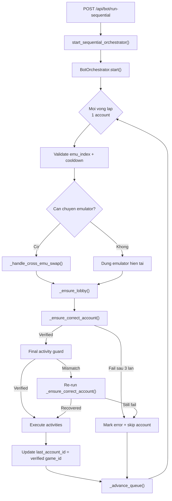
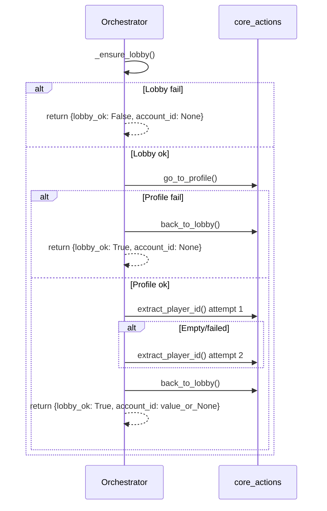

# Bot Orchestrator - Co che Swap Account va Swap Emulator

Tai lieu nay mo ta dung luong xu ly swap trong `BotOrchestrator` sau khi bo sung co che **xac minh account bang live game_id** truoc khi chay activity.

Muc tieu moi:

```text
expected_game_id == actual_account_id
```

Neu dieu kien tren chua dung, orchestrator **khong duoc phep** chay activity.

---

## 1. Tong quan kien truc



Diem khac biet lon nhat so voi co che cu:

- Co che cu: swap xong -> assume thanh cong -> chay activity.
- Co che moi: vao lobby -> doc live account id -> swap neu can -> verify -> chi khi dung account moi chay activity.

---

## 2. File va function map

| File | Function | Vai tro |
|------|----------|---------|
| `backend/core/workflow/bot_orchestrator.py` | `BotOrchestrator.start()` | Vong lap chinh cua sequential orchestrator |
| `backend/core/workflow/bot_orchestrator.py` | `_handle_cross_emu_swap()` | Tat emulator cu, mo emulator moi |
| `backend/core/workflow/bot_orchestrator.py` | `_ensure_lobby()` | Wrapper async de dam bao game dang o lobby |
| `backend/core/workflow/bot_orchestrator.py` | `_read_live_account_id()` | Doc live `game_id` tu game bang flow Profile -> Copy ID |
| `backend/core/workflow/bot_orchestrator.py` | `_restart_game_app()` | Force-stop app, mo lai game, vao lobby |
| `backend/core/workflow/bot_orchestrator.py` | `_ensure_correct_account()` | Core logic verify/swap/retry toi da 3 lan |
| `backend/core/workflow/core_actions.py` | `startup_to_lobby()` | Dam bao game dang chay va ve lobby |
| `backend/core/workflow/core_actions.py` | `go_to_profile()` | Mo profile menu |
| `backend/core/workflow/core_actions.py` | `extract_player_id()` | Copy va doc player id tu clipboard |
| `backend/core/workflow/core_actions.py` | `back_to_lobby()` | Quay lai lobby sau khi doc id |
| `backend/core/workflow/core_actions.py` | `swap_account()` | Chay flow doi account trong game |
| `backend/core/workflow/account_detector.py` | `check_account_name()` | OCR tim account theo `lord_name` trong danh sach character |

---

## 3. Du lieu danh tinh duoc su dung

Trong orchestrator, payload account co cac field quan trong:

```python
{
    "id": 123,
    "game_id": "16025772",
    "emu_index": 1,
    "lord_name": "My Lord"
}
```

Quy uoc:

- `game_id`: hard identity, dung de verify active account.
- `lord_name`: chi la selector hint de giup `swap_account()` OCR dung dong account nhanh hon.
- `last_account_id`: khong con la source of truth. Day chi la cache cua **last verified live account**.

---

## 4. Luong chay chinh trong `start()`

Moi iteration xu ly 1 account theo thu tu queue.

### Buoc 1 - Validate emulator assignment

```text
if emu_index is None:
    mark error
    advance queue
```

### Buoc 2 - Check cooldown

```text
if account dang trong cooldown:
    skip tam thoi
    neu tat ca account deu cooldown -> sleep den account gan nhat san sang
```

### Buoc 3 - Cross-emulator swap neu can

`last_emu_index` chi dung de quyet dinh co can tat emulator cu / mo emulator moi khong.

- Neu `last_emu_index != emu_idx` -> goi `_handle_cross_emu_swap()`.
- Neu `last_emu_index == emu_idx` -> o lai emulator hien tai, nhung **van phai verify live account**.
- Neu la lan dau chay -> launch emulator neu chua mo.

### Buoc 4 - Ensure lobby

Truoc khi doc account id hay swap, orchestrator luon goi:

```python
await self._ensure_lobby(serial, detector, 120)
```

Neu khong vao duoc lobby:

- mark account la `error`
- skip account
- advance queue

### Buoc 5 - Ensure correct account

Sau khi lobby da san sang, orchestrator goi:

```python
account_ready, verified_account_id = await self._ensure_correct_account(
    serial,
    detector,
    account_detector,
    expected_game_id,
    target_lord,
)
```

Neu `account_ready == False`:

- mark account `error`
- khong chay activity
- advance queue

### Buoc 6 - Final activity guard

Ngay truoc khi chay activity, orchestrator **doc live account id mot lan nua**:

```python
final_guard = await self._read_live_account_id(serial, detector, "final activity guard")
```

Neu `final_guard["account_id"] != expected_game_id`:

- log mismatch
- goi lai `_ensure_correct_account()` mot lan nua
- neu van fail -> skip account

### Buoc 7 - Execute activities

Chi sau khi account da verified, orchestrator moi:

- reset `activity_statuses`
- build steps bang `workflow_registry.build_steps_for_activity()`
- chay tung activity theo thu tu
- cap nhat execution log va websocket state nhu cu

### Buoc 8 - Cap nhat cache runtime

Sau khi account run xong:

```python
last_emu_index = emu_idx
last_account_id = verified_account_id
```

Y nghia:

- `last_emu_index`: emulator dang active o cuoi iteration.
- `last_account_id`: live account da duoc verify thanh cong, khong phai account du kien.

---

## 5. Chi tiet `_read_live_account_id()`

Ham nay la source of truth cho active account.

### Preconditions

Truoc khi doc ID:

1. goi `_ensure_lobby()`
2. chi doc ID khi lobby da confirmed

### Flow



### Quy tac reliability

- Neu `extract_player_id()` fail lan 1 -> retry 1 lan nua.
- Neu van fail -> `account_id = None`.
- Du thanh cong hay that bai, sau khi doc xong deu quay lai lobby.

---

## 6. Chi tiet `_ensure_correct_account()`

Day la ham trung tam cua co che moi.

### Dau vao

- `expected_game_id`: account can chay.
- `target_lord`: OCR hint de `swap_account()` tim dung dong account.

### Luong xu ly

#### Phase A - Pre-swap verification

```text
read current live account id
if current == expected:
    success ngay, khong swap
else:
    bat dau retry ladder
```

#### Phase B - Retry ladder (toi da 3 lan)

##### Attempt 1

- goi `swap_account(serial, account_detector, detector, target_lord)`
- vao lobby lai
- doc `actual_account_id`
- neu match -> success

##### Attempt 2

- lap lai y chang attempt 1

##### Attempt 3

- goi `_restart_game_app()` truoc
- sau do moi chay `swap_account()`
- vao lobby lai
- doc `actual_account_id`
- neu match -> success

### Logging mismatch

Neu verify fail nhung van doc duoc live id:

```text
expected_game_id=...
actual_account_id=...
```

Neu khong doc duoc id:

```text
actual_account_id=<unreadable>
```

### Ket qua

- `return (True, actual_account_id)` khi verified dung account.
- `return (False, last_read_account_id_or_None)` khi het 3 lan ma van khong dung.

---

## 7. Chi tiet `_restart_game_app()`

Day la recovery path chi dung o attempt 3.

Flow:

```text
adb shell am force-stop com.farlightgames.samo.gp.vn
sleep 2s
startup_to_lobby()
```

Luu y:

- Day la **restart app**, khong phai reboot emulator.
- Neu restart app fail, orchestrator van tiep tuc attempt 3, nhung kha nang verify thanh cong se phu thuoc vao viec game co vao lai lobby duoc hay khong.

---

## 8. In-game swap qua `swap_account()`

`swap_account()` van giu kien truc cu, nhung hien tai orchestrator truyen `target_lord` neu co, nen uu tien OCR mode thay vi blind toggle mode.

### OCR mode

Khi `target_lord` co gia tri:

- `AccountDetector.check_account_name()` tim dong account trong Character Management.
- Neu tim thay -> tap vao dong do.
- Neu account da la active account -> `swap_account()` back ra lobby va return `True`.

### Toggle fallback

Khi `target_lord` la `None`:

- `swap_account()` fallback ve logic tap slot character 1 / 2.

### Dieu quan trong

`swap_account()` **khong con la nguon xac nhan thanh cong**.

Success that su chi duoc xac nhan boi:

```text
_read_live_account_id() -> actual_account_id == expected_game_id
```

---

## 9. Quy tac cache va safety

### `last_account_id`

Quy tac moi:

- Chi update khi account da duoc verify thanh cong.
- Khong update bang account du kien neu swap fail.
- Khong update khi lobby fail.
- Khong update khi live ID unreadable.

### He qua

Co che nay ngan bug cu:

```text
bot nghi dang o account B
nhung game van dang o account A
```

Vi tu nay, cache chi luu **account da verify**, khong luu account "du kien".

---

## 10. Edge cases va cach xu ly

| Tinh huong | Xu ly |
|-----------|-------|
| Account khong gan emulator | Mark error, skip account |
| Emulator boot timeout 120s | Retry 60s; neu van fail -> skip account |
| Cross-emu swap fail | Skip account, khong update `last_emu_index` |
| Khong vao duoc lobby truoc verify | Verification fail cho account do |
| `extract_player_id()` fail lan 1 | Retry doc ID them 1 lan |
| `extract_player_id()` fail lan 2 | Xem nhu unreadable verification |
| Swap xong nhung live ID van sai | Retry attempt tiep theo |
| Attempt 1 va 2 deu fail | Attempt 3 restart app roi swap lai |
| Het 3 attempt van sai account | Mark error, skip account, khong chay activity |
| Final activity guard phat hien mismatch | Re-run `_ensure_correct_account()` mot lan nua |
| User stop bot | `main_task.cancel()` -> `CancelledError` -> finally cleanup |

---

## 11. Lifecycle tong the

```text
User bam Start Bot
-> API /api/bot/run-sequential
-> start_sequential_orchestrator()
-> asyncio.create_task(orch.start())

Moi account:
1. validate emu_index
2. check cooldown
3. launch/cross-swap emulator neu can
4. _ensure_lobby()
5. _ensure_correct_account()
6. final activity guard (_read_live_account_id)
7. execute activities
8. update verified cache
9. advance queue
```

Vong lap chay lien tuc cho den khi:

- user goi stop
- hoac task bi cancel

---

## 12. Tom tat thay doi quan trong so voi version cu

### Truoc day

```text
same emulator + different account
-> swap_account()
-> assume success
-> run activities
```

### Bay gio

```text
same emulator + different account
-> read live game_id
-> swap_account() neu can
-> verify live game_id
-> retry toi da 3 lan
-> chi khi dung account moi run activities
```

Ket qua:

- Khong chay activity tren nham account.
- Co gioi han retry ro rang, khong loop vo han.
- Co recovery path bang app restart o lan thu 3.
- `game_id` tro thanh source of truth cho account correctness.
