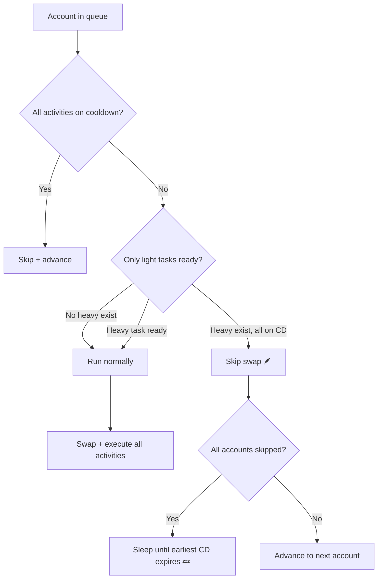

# Activity Weight System — Walkthrough

## What Changed

### 1. Registry — `weight` field on all 19 activities

render_diffs(file:///f:/COD_CHECK/UI_MANAGER/backend/core/workflow/workflow_registry.py)

| Weight | Activities |
|--------|-----------|
| ⚡ **Heavy** (10) | gather_rss_center, gather_resource, full_scan, catch_pet, train_troops, heal_troops_task, attack_darkling_legions, research_technology_task, rotating_event, season_policies_task |
| 🪶 **Light** (9) | claim_mail_reward, claim_resources, claim_alliance_resource, alliance_help, tavern_chest_draw, chat_with_hero_task, buy_merchant_items_task, claim_daily_vip_gift_task, clean_trash_pet_sanctuary_task |

---

### 2. Orchestrator — New `_only_light_tasks_ready()` + main loop integration

render_diffs(file:///f:/COD_CHECK/UI_MANAGER/backend/core/workflow/bot_orchestrator.py)

**Core logic**: Before swapping into an account, the bot now checks if heavy tasks exist but are all on cooldown while only light tasks are ready. If so, it **skips the swap** to preserve the global cooldown for heavy tasks.

---

### 3. Frontend — Weight badge + config dropdown

render_diffs(file:///f:/COD_CHECK/UI_MANAGER/frontend/js/pages/workflow.js)

- **Activity list**: Shows `⚡` (heavy) or `🪶` (light) emoji next to each activity name
- **Config panel**: New "Priority Weight" section with a dropdown to change Light ↔ Heavy per group
- Changing weight saves to `config.weight` in the per-group config JSON
- If user promotes a light task to heavy, the orchestrator includes it in the "has heavy ready" check

### 4. CSS — Badge styling

render_diffs(file:///f:/COD_CHECK/UI_MANAGER/frontend/css/workflow.css)

---

## Verification

| Check | Result |
|-------|--------|
| `workflow_registry.py` syntax | ✅ Pass |
| `bot_orchestrator.py` syntax | ✅ Pass |
| Browser UI test | ⏸ Server not running — verify when app starts |

## How to Verify in Practice

When you next run the bot with mixed heavy/light activities:

1. Look for log messages: `[BotOrchestrator] Only light activities ready for Account X. Skipping swap to preserve cooldown for heavy tasks.`
2. The timeline should show: `🪶 Skipped [name]: only light tasks ready, waiting for heavy`
3. When a heavy task comes off cooldown, the bot should swap and run **both** heavy and light tasks together
